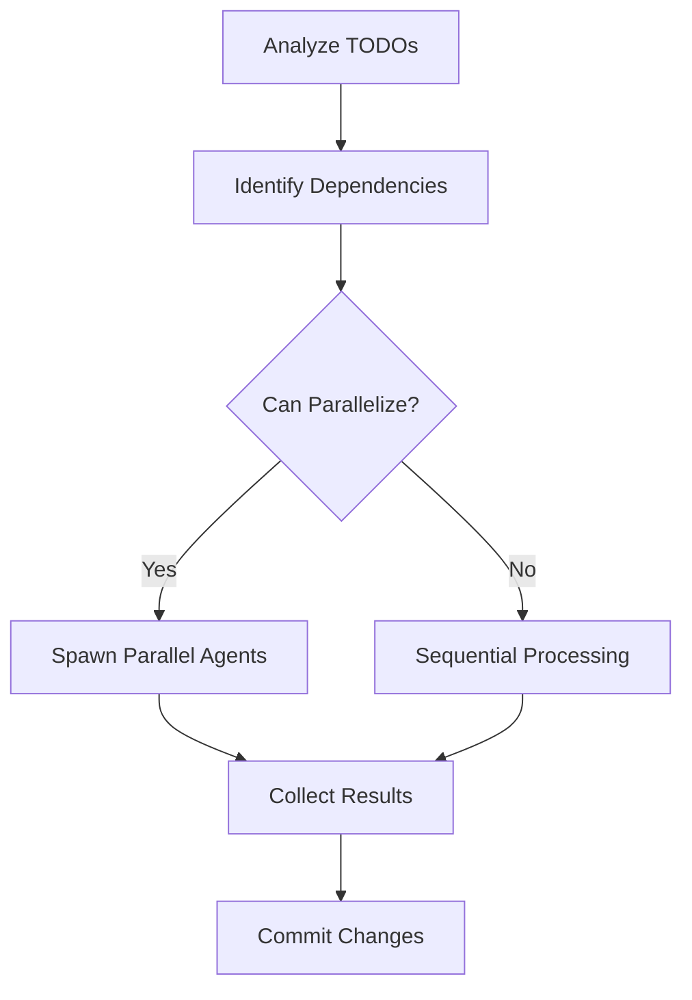

# Resolve TODOs in Parallel

Systematically address unresolved TODO comments through parallel agent execution.

## Workflow

### Phase 1: Analysis

Get all unresolved TODOs from the `/todos/*.md` directory or scan the codebase for TODO comments.

```bash
# Find TODO files
ls todos/*.md 2>/dev/null || echo "No todos directory"

# Or scan codebase
grep -r "TODO" --include="*.py" --include="*.js" --include="*.ts" --include="*.rb" .
```

### Phase 2: Planning

1. Create a grouped inventory of unresolved items
2. Identify dependencies between items
3. Visualize the workflow using a mermaid diagram



### Phase 3: Implementation

Spawn a `pr-comment-resolver` agent for each unresolved item in parallel.

**Key Strategy**: Launch multiple concurrent agents simultaneously—one per TODO item—rather than sequential processing.

Only process items sequentially when they have explicit dependencies.

### Phase 4: Resolution

1. Commit modified files
2. Remove TODO markers from resolved items
3. Update the remote repository

## Dependency Handling

Before parallelizing, check for:
- Shared file modifications
- Sequential logic dependencies
- Database migration order
- Test dependencies

## Output

Report on:
- Total TODOs processed
- Successfully resolved items
- Items requiring manual attention
- Any errors encountered
